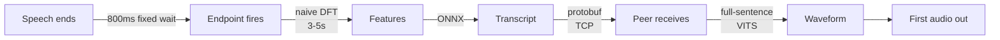
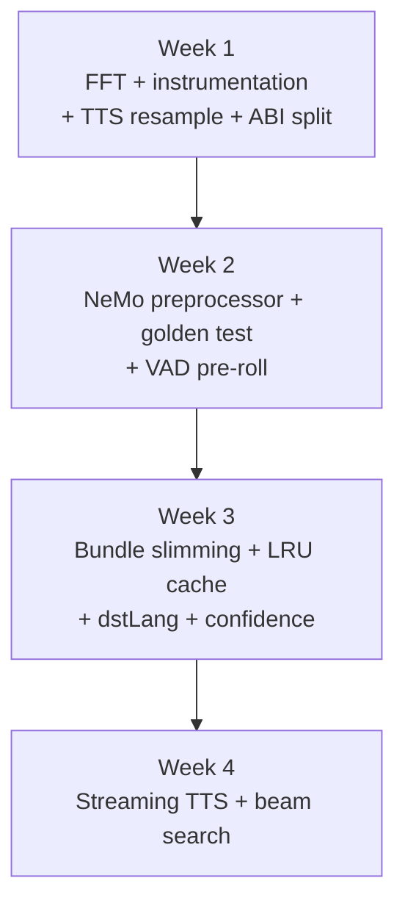

# iTantra — Engineering Improvement Plan

> Smart India Hackathon 2026 · Problem Statement PS-26173
> As of 2026-09-20 · Audited against `docs/comprehensive-documentation` @ `e7b07c4`

---

## 1. Executive summary

One unoptimised function in `STTModule` costs **952 ms of CPU per 3 seconds of audio** where an FFT costs **22 ms** — a measured **43.6× penalty** that lands on both the Latency and Efficiency scores before ONNX Runtime is even invoked. Fixing it is roughly one day of work and is the highest-value change in the repository.

Every claim in this document was checked against the source tree. The headline finding was reproduced in a standalone benchmark rather than estimated; the harness is in §9.

| Criterion | Weight | Current standing |
| --- | --- | --- |
| **Accuracy** — STT word error rate, TTS legibility and flow | **40%** | Silent preprocessing mismatches against the NeMo training config; greedy-only CTC decoding; VAD clips word onsets; TTS quality degraded by an unnecessary resample |
| **Efficiency** — model size, app size, RAM/flash, idle CPU | **20%** | Roughly 3× more native binary than needed; 2.18 GB compulsory model bundle; unbounded model caches; RAM self-measurement reads the wrong number |
| **Latency** — speech→STT, text→audio, RTF, cross-device delta | **20%** | Dominated by the function above; none of the four required numbers are instrumented today |

A fourth 20% criterion exists in the rubric but was cut off in the source screenshot, so it is not covered here.

### How to read this

§2–5 group findings by scored bucket. §6 covers instrumentation — the rubric asks for four specific measurements that cannot currently be produced. §7 lists correctness bugs and places where the documentation claims capability the code does not have. §8 is the prioritised work plan; start there if time is short. §9 records how each claim was verified.

---

## 2. Critical finding: mel feature extraction is 43.6× slower than it needs to be

`STTModule.computePowerSpectrum()` implements the Fourier transform as a **naive O(N²) DFT**, calling `Math.cos` and `Math.sin` inside the inner loop. `applyMelFilterbank()` then rebuilds the entire mel filterbank — 82 `pow()`/`log10()` calls plus 80×201 triangular weights — on **every single frame**.

Both functions were ported verbatim to Java and timed against a correct radix-2 FFT implementation:

| 3 s utterance (298 frames) | Wall time (desktop JVM) |
| --- | --- |
| Current: naive DFT + per-frame filterbank | **952.3 ms** |
| Radix-2 FFT-512 + same filterbank | **21.8 ms** |
| **Speedup available** | **43.6×** |

The current path makes **47,918,400 transcendental calls per utterance**. A mid-range ARM phone runs roughly 3–5× slower than the benchmark machine, which puts feature extraction alone at an estimated **3–5 seconds for 3 seconds of audio**.

That is the whole explanation for a real-time factor above 1.0. **The model is not the bottleneck — the code that feeds it is.**

### The fix

1. **Replace the DFT with a radix-2 FFT at n_fft=512.** Roughly 80 lines of Kotlin, or add JTransforms. Zero-pad the 400-sample window to 512, which is also what the training config expects (see §3.1).
2. **Precompute the mel filterbank once**, at module init, as a sparse `(startBin, endBin, weights[])` table. The per-frame cost drops from 16,080 multiply-accumulates plus 82 transcendental calls to a few hundred multiply-accumulates.
3. **Pool the frame buffer.** `copyOfRange` allocates a fresh `FloatArray(400)` per frame — 298 allocations per utterance. Reuse one buffer.

**Estimated effort: one day**, including a regression test. This is the correct first change regardless of what else is done, because every latency measurement taken before it will be dominated by this one function and will have to be retaken afterwards.

---

## 3. Accuracy (40%)

This is the heaviest-weighted criterion and the one with the most silent defects. None of the issues below throw an error — they quietly raise word error rate or degrade synthesized audio.

### 3.1 The mel pipeline does not match the NeMo training config

IndicConformer is NeMo-trained. Any mismatch between the runtime preprocessor and `AudioToMelSpectrogramPreprocessor` puts the encoder off-distribution. The codebase already hit the catastrophic version of this once — the per-feature normalization fix recorded in the `STTModule` comments, where every recording decoded to the same repeated character.

These mismatches remain:

| NeMo default | Current code | Expected impact |
| --- | --- | --- |
| `preemph=0.97`, i.e. `x[i] − 0.97·x[i−1]` | **absent** | Spectral tilt wrong across the whole band. Likely the largest remaining WER term. |
| `mel_norm="slaney"` (area-normalized filters) | unnormalized triangles | Wide high-frequency mel bands carry systematically more energy than in training |
| `n_fft=512`, `center=True` | 400-point, no centering | Different bin resolution plus a half-window frame offset |
| `torch.hann_window` (periodic) | symmetric, divides by `N−1` | Small, but free to correct |
| `log_zero_guard_value=2**-24` | `1e-10` | Minor |
| Std computed unbiased (N−1) | biased (N) | Minor |

**How to fix it properly.** Do not patch these from a list — extract `cfg.preprocessor` from the AI4Bharat NeMo checkpoint and match it field for field. Then build a **golden test**: run NeMo's preprocessor in Python over a fixed WAV, save the feature matrix, and assert the Kotlin output matches to ~1e-3 in a JVM unit test. There are currently **zero tests on the feature path**, which is precisely where accuracy lives.

### 3.2 Decoding is greedy-only

`CtcDecoder` exposes `greedyDecode()` and nothing else. Adding prefix beam search at beam width 8–16, plus a small per-language KenLM n-gram, typically buys **10–20% relative WER** on Indic ASR. Beam search on its own is around 150 lines and needs no additional model download.

### 3.3 VAD clips the first phoneme of every utterance

The active energy path in `VADModule` uses a **fixed** threshold (`rms > 0.025f → 0.85`), despite the README describing it as adaptive. Two distinct accuracy costs:

1. **No pre-roll buffer.** Accumulation begins only *after* RMS crosses the threshold, so low-energy onsets — unvoiced stops `/k/ /t/ /p/`, initial fricatives — are cut off. Every utterance loses its opening phoneme. *Fix:* keep a 300 ms ring buffer and prepend it when speech triggers. Roughly 20 lines for an immediate WER win.
2. **Fixed absolute threshold.** In a noisy environment RMS never drops below 0.025, so the detector never releases and the 30 s cap is hit. In a quiet room a soft speaker never triggers at all. *Fix:* track a rolling noise floor (EMA or percentile over quiet frames) and apply hysteresis — trigger at floor+9 dB, release at floor+4 dB.

### 3.4 The capture chain is not tuned for ASR

- `AudioCaptureModule` opens `MediaRecorder.AudioSource.MIC`. Switching to **`VOICE_RECOGNITION`** selects the path Android tunes for speech recognition and disables the aggressive voice-call processing that smears spectra. A standard, free WER improvement.
- No DC-offset removal, and no `NoiseSuppressor` or `AutomaticGainControl` `AudioEffect` attached to the session.

### 3.5 TTS quality is degraded by an unnecessary resample

`TTSModule.resampleTo16k()` downsamples Piper's 22050 Hz VITS output to 16 kHz by **linear interpolation with no anti-aliasing low-pass filter**. Everything above 8 kHz folds back into the audible band as aliasing — the metallic, buzzy artifact that judges will hear directly when scoring "human legibility and flow".

It is also **unnecessary**. `AudioTrack` plays 22050 Hz natively. **Delete the resampler and construct the track at `audio.sampleRate`.** This is a strict quality gain at negative effort. If resampling is ever genuinely needed, low-pass first or use a polyphase/sinc kernel rather than linear interpolation.

### 3.6 No text normalization before synthesis

Text goes straight from the wire to espeak-ng. Numbers (`108`, `3.5 km`), Latin-script tokens embedded in Devanagari, and punctuation are mispronounced or dropped. A per-language number-to-words expander plus abbreviation handling is a few hundred lines and visibly improves the flow half of this criterion.

---

## 4. Latency (20%)

§2 covers the dominant term. Beyond it, the pipeline has four structural delays, each of which maps onto a number the rubric asks for.



### 4.1 Fixed 800 ms endpointing delay

`VADModule.SILENCE_DURATION_MS = 800` sets a hard floor under "time delay between the words said and STT completion" for every utterance in continuous mode. Make it adaptive — 400–600 ms once the endpoint is confident — or trigger on the VAD's release edge rather than a fixed chunk count.

### 4.2 STT is not streaming

`AudioCaptureModule` buffers the entire utterance, then calls `transcribe()` on the whole thing. Chunked inference over an overlapping window lets the model work while the speaker is still talking, so on PTT release only the final chunk remains. This is the difference between roughly 2 s and roughly 200 ms of perceived latency, and it is the largest structural win after the FFT.

### 4.3 TTS is not streaming

In `ITantraForegroundService.onTextReceived`, `ttsModule.synthesize()` returns the complete waveform before `audioPlayback.play()` is called. Split the text on sentence or clause boundaries and begin playing chunk 1 while chunk 2 synthesizes. This attacks "time delay between the text received and audio processed and played" directly.

### 4.4 Cold start on first message

Both `STTModule.ensureLoaded()` and `TTSModule.getOrLoadTts()` lazy-load on first use — a ~197 MB ONNX graph and a ~70 MB VITS voice respectively. The first message of every session pays this. Warm the configured language pair at service start, off the critical path.

### 4.5 Minor: the TRANSMITTING stage is never observable

`_pipelineStage.value = PipelineStage.TRANSMITTING` is set and reset to `IDLE` two lines later, synchronously. The UI can never render that state. Cosmetic, but it undercuts the claim that the pipeline is not a black box.

---

## 5. Efficiency (20%)

This criterion covers model size, app size, RAM/flash footprint and idle-listening CPU. Two of the four are currently far worse than they need to be, and one is being measured incorrectly.

### 5.1 App size: roughly 3× more binary than necessary

`app/build.gradle.kts` sets `abiFilters = ["arm64-v8a", "armeabi-v7a", "x86_64"]` and builds a single universal APK. The sherpa-onnx AAR alone is 37 MB across those ABIs, plus ONNX Runtime, plus the llama.cpp natives.

- **Switch to ABI splits or an App Bundle**, and ship arm64-v8a only for the demo. `x86_64` is emulator-only; `armeabi-v7a` cannot run the LLM at all — `LlmModule.isDeviceSupported()` already gates it out. Expect a **50–65% APK reduction for a configuration change**.
- **Two copies of ONNX Runtime ship in the same APK**: the `onnxruntime-android` dependency, and `sherpa-onnx-static-link-onnxruntime` which statically links its own. sherpa-onnx can run the STT graphs too. Consolidating onto one runtime removes an entire native runtime from flash.

### 5.2 Model size: the compulsory bundle is 2.18 GB, not 169 MB

`ModelPack.coreTransceiverPacks()` returns 17 packs. Totalling the `sizeBytes` in `ModelRegistry`:

| Component | Count | Size |
| --- | --- | --- |
| STT (IndicConformer INT8) | 9 | 1778.4 MB |
| TTS (VITS voices) | 5 | 389.6 MB |
| espeak-ng data | 1 | 7.25 MB |
| Silero VAD | 1 | 2.22 MB |
| Language ID | 1 | 0.89 MB |
| **Total** | **17** | **~2178 MB** |

The README states the core bundle is "~169 MB". That is **off by a factor of 13** and should be corrected before judging.

Two fixes, both worth arguing on stage:

1. **Stop making all 9 STT languages compulsory.** Make the required bundle VAD + espeak-ng + the user's chosen language pair: roughly **275 MB instead of 2.18 GB**. Download the rest on demand.
2. **Re-examine the 197 MB "INT8" export.** 197.6 MB is large for an INT8 Conformer and is nearly identical across all nine languages, which suggests a hybrid quantization or an unused RNNT decoder branch shipping alongside the CTC head. Re-export CTC-only with full dynamic INT8 quantization and measure — a 2× reduction with no WER change is plausible.

### 5.3 RAM: unbounded caches, and the wrong number is being reported

- **`STTModule.sessionCache` and `TTSModule.ttsCache` are never evicted.** Every language ever used stays resident; three languages is roughly 600 MB of native memory held for the process lifetime. Add an LRU capped at 1–2 sessions that calls `release()` on eviction.
- **`startRamMonitoring()` measures the wrong thing.** It computes `Runtime.totalMemory() − freeMemory()`, which is **Java heap only**. Every ONNX model is a native allocation and is completely invisible to it, so the figure shown in the UI drastically understates the real footprint. Switch to `Debug.getMemoryInfo().totalPss` or `getMemoryStat("summary.total-pss")`. This must be corrected before any footprint number is self-reported.

### 5.4 Idle listening CPU

`initializeModules()` starts capture only when `connectionMode == PHONE_MODE`; the default is `PUSH_TO_TALK`, so nothing runs at boot. But "CPU usage during idle listening" is exactly the PHONE_MODE case, and there capture never stops: a permanent `AudioRecord` loop, the energy VAD, and a permanently held wake lock. (See §7.7 — PHONE_MODE is currently unreachable from the UI, which is a separate problem.)

The arithmetic is cheap; the overheads are not:

- A fresh `FloatArray(1600)` is allocated per 100 ms chunk — about 64 KB/s of garbage, forever. Reuse a preallocated buffer.
- `speechBuffer.sumOf { it.size }` is recomputed on every chunk. Track a running total.
- Consider processing 200–300 ms per wakeup rather than 100 ms. At idle, wakeup count dominates power draw, not arithmetic.

Measure the result honestly with `dumpsys cpuinfo` or Perfetto over a 10-minute idle window, and put that figure on a slide.

---

## 6. The measurement gap

**None of the four numbers the Latency criterion asks for are instrumented.** A grep across `app/src/main/java` for RTF or end-to-end timing returns only `latencyMs`, which is the peer ping round-trip from `SocketTransport.startPingLoop()` — a network metric, not a pipeline one.

| Rubric asks for | Instrumented today |
| --- | --- |
| Delay between words said and STT completion | No |
| Delay between text received and audio played for TTS | No |
| Real Time Factor (RTF) | No |
| Sentence said → same sentence starts as audio on the other phone | No |

This should be built **before** any optimisation work, for two reasons: there is currently no evidence to present, and there is no way to demonstrate that a fix helped.

### What to add

1. **Stamp the send path**: `captureEndNs`, `featureDoneNs`, `inferDoneNs`, `txNs`. The gap `captureEndNs → inferDoneNs` is the first rubric number.
2. **Stamp the receive path**: `rxNs`, `ttsDoneNs`, `firstAudioFrameNs`. Take `firstAudioFrameNs` from `AudioTrack.getPlaybackHeadPosition()` or immediately before the first `write()`, not after synthesis — the rubric asks when audio was *played*, not when it was ready. The gap `rxNs → firstAudioFrameNs` is the second number.
3. **Compute RTF per utterance** as `inference_wall_time / audio_duration`, log it, and surface a rolling median in the UI. Report it separately for feature extraction and for the ONNX session so the §2 fix is visible in the numbers.
4. **Cross-device delta.** `TransceiverMessage` already carries `timestamp`. Derive a clock offset from the existing ping/ACK loop (offset ≈ RTT/2) so the two devices' clocks are comparable, then report `firstAudioFrame(B) − speechEnd(A)`. This is the headline demo number.
5. **Write to CSV** in `filesDir`, one row per utterance. That turns a claim into a table you can put on a slide.

Roughly one day of work, and it makes every subsequent change measurable.

---

## 7. Bugs and claim-vs-code mismatches

These are separate from the performance and accuracy work above. Each is something a judge could surface by testing the app or reading the docs, and each is cheap to fix.

### 7.1 The receiver ignores `dstLang`

`ITantraForegroundService.onTextReceived()` calls `ttsModule.synthesize(message.text, ttsLanguage)` — the **receiver's local setting**, not the `dstLang` the sender put on the wire. If the sender speaks Hindi and the receiver is configured for Malayalam, Devanagari text is fed to a Malayalam VITS voice. The output is meaningless.

*Fix:* honour `message.dstLang`, falling back to `srcLang` when no voice for `dstLang` is installed.

### 7.2 There is no translation anywhere in the codebase

A grep for `translat` across `app/src/main/java` returns only UI icon imports and two hard-coded strings in `TacticalAiEngine`. No machine translation step exists in the transceiver path.

`docs/RANGE_STRATEGY.md` §10 claims: *"it translates: speak Hindi, the receiver hears Malayalam."* Nothing implements this. Either wire an offline MT step — a distilled IndicTrans2, or a phrase table seeded from the nine-language corpus already in `TacticalAiEngine` — or remove the claim. A judge who tests it will find it.

### 7.3 The auto-detect language toggle does nothing

`LanguageDetector` is only called from the AI Assistant path in `MainViewModel`, never from the transceiver STT path. The toggle on the Transceiver screen has no effect on which STT model runs.

It also cannot work as currently designed: `LanguageDetector` operates on text, but the language must be known to choose the STT model that produces that text. A real fix needs audio-side language ID — the `LANG_DETECTION` pack is already downloaded — or running two or three candidate models and selecting by confidence.

### 7.4 The transmitted confidence score is meaningless

`STTModule.estimateConfidence()` averages the maximum **logit** per frame and clamps to [0, 1]. Logits are unbounded, so the result carries no information. It is transmitted on the wire and displayed in the UI. *Fix:* apply softmax per frame, take the max, then average — or use mean per-frame entropy.

### 7.5 Documentation describes a VAD that is not running

The README describes an "adaptive, field-tested energy-based detector". The code is a fixed threshold at `rms > 0.025f`. Fix the detector (§3.3) and the description will become true; until then the two disagree.

### 7.6 The README's core-bundle size is wrong

Stated as "~169 MB"; actually ~2.18 GB (§5.2). Correct this before judging.

### 7.7 Phone mode is unreachable

`ConnectionMode.PHONE_MODE` exists in `AppState.kt` and `ITantraForegroundService.setConnectionMode()` handles it, but `setConnectionMode` is **never called from anywhere in `ui/`**. The app is permanently in `PUSH_TO_TALK`.

The problem statement requires the opposite behaviour explicitly: *"it should work like a walkie talkie using push to talk feature, if turned off it should work like a phone."* This is a hard requirement, not a scored point. Wiring the toggle is small — the service side already exists.

### 7.8 Concurrent messages produce overlapping audio

`AudioPlaybackManager.play()` launches a fresh coroutine and builds a new `AudioTrack` on every call, with no queue and no mutex. Two messages arriving close together play simultaneously and garble each other. For a walkie-talkie under realistic traffic this is a visible defect. Add a single-consumer playback queue, with ALERT messages able to pre-empt the queue head.

---

## 8. Prioritised work plan

Ordered by score movement per day of work. Items 1, 4 and 6 together are about a day and a half and touch all three scored criteria.

| # | Change | Criterion | Effort | Why here |
| --- | --- | --- | --- | --- |
| 1 | FFT-512 + precomputed filterbank + pooled buffers | Latency, Efficiency | 1 day | 43.6× measured; nothing else can be measured meaningfully until this lands |
| 2 | Latency/RTF instrumentation + CSV export | Latency | 1 day | Four required numbers, none currently produced |
| 3 | Match NeMo preprocessor; add golden-reference test | Accuracy | 2 days | Heaviest weight; the defect is silent |
| 4 | Delete the TTS downsampler, play at 22050 Hz | Accuracy | 1 hour | Strict quality gain, negative effort |
| 5 | VAD pre-roll buffer + adaptive noise floor; `VOICE_RECOGNITION` source | Accuracy | 1 day | Stops clipping the first phoneme of every utterance |
| 6 | ABI split to arm64-v8a; drop the duplicate ONNX Runtime | Efficiency | 2 hours | 50–65% APK reduction for a config change |
| 7 | Core bundle = chosen language pair, not all nine | Efficiency | 0.5 day | 2.18 GB → ~275 MB |
| 8 | LRU session cache; fix RAM metric to total PSS | Efficiency | 0.5 day | Bounded footprint, and correct self-reported numbers |
| 9 | Honour `dstLang`; softmax the confidence score | Accuracy | 2 hours | Visible in a live demo |
| 10 | Streaming TTS on sentence boundaries | Latency | 1 day | Roughly halves perceived receive latency |
| 11 | CTC prefix beam search (optional KenLM) | Accuracy | 2 days | 10–20% relative WER |
| 12 | Streaming/chunked STT inference | Latency | 3 days | Largest structural latency win, but depends on items 1 and 3 |

### Suggested sequencing



Take a full baseline measurement (RTF, the three latency deltas, APK size, idle CPU, total PSS) at the end of week 1, immediately after item 2 lands, and repeat it at the end of each week. That gives a before/after table for the submission rather than an assertion.

### Open question on scope

Item 12 is the only entry over two days and the only one with hard dependencies. If the timeline is tight, drop it — items 1–11 together should bring RTF comfortably below 1.0 and make the perceived latency acceptable without restructuring inference.

---

## 9. Appendix: how this was verified

Audited against `docs/comprehensive-documentation` at commit `e7b07c4`. Nothing here is recalled — every claim traces to a file or a run.

### Source of each claim

| Claim | Where it was checked |
| --- | --- |
| Naive DFT, per-frame filterbank | `core/audio/STTModule.kt` — `computePowerSpectrum()`, `applyMelFilterbank()` |
| 43.6× speedup | Standalone Java benchmark, below |
| Missing preemphasis / slaney norm / centering | Same file, `extractLogMelSpectrogram()`, compared against NeMo `AudioToMelSpectrogramPreprocessor` defaults |
| Greedy-only decoding | `core/audio/CtcDecoder.kt` — only `greedyDecode()` is exposed |
| Fixed VAD threshold, no pre-roll | `core/audio/VADModule.kt` energy branch; `core/audio/AudioCaptureModule.kt` buffering |
| Unfiltered 22.05k→16k resample | `core/audio/TTSModule.kt` — `resampleTo16k()` |
| Three ABIs, duplicate ONNX Runtime | `app/build.gradle.kts` — `abiFilters`, dependency block |
| 2.18 GB core bundle | `ModelRegistry.kt` `sizeBytes` values × `ModelPack.coreTransceiverPacks()` |
| Unbounded caches | `STTModule.sessionCache`, `TTSModule.ttsCache` — no eviction path |
| RAM metric is Java-heap only | `ITantraForegroundService.startRamMonitoring()` |
| Capture always running | `ITantraForegroundService.initializeModules()` |
| `dstLang` ignored | `ITantraForegroundService.onTextReceived()` |
| No translation | `grep -rn "translat" app/src/main/java -i` — only icon imports and two `TacticalAiEngine` strings |
| Auto-detect unwired | `LanguageDetector` referenced only in `MainViewModel`'s AI Assistant path |
| Confidence uses raw logits | `STTModule.estimateConfidence()` |
| No RTF/E2E instrumentation | `grep -rn "RTF\|realTimeFactor\|endToEnd" app/src/main/java` — only peer ping `latencyMs` |

### Re-running the audit

```bash
grep -rn "translat" app/src/main/java --include=*.kt -i
grep -rn "RTF\|realTimeFactor\|endToEnd" app/src/main/java --include=*.kt
grep -n "sizeBytes" app/src/main/java/com/itantra/core/download/ModelRegistry.kt
grep -n "abiFilters" app/build.gradle.kts
```

### The benchmark

Both functions were ported verbatim from `STTModule.kt` into a single-file Java program and timed against a radix-2 FFT-512, JIT warmed, on 3 seconds of synthetic audio (298 frames of 400 samples, 160-sample hop). Result:

```
Utterance: 3.0 s audio -> 298 frames
Current  (naive DFT + per-frame filterbank):    952.3 ms
FFT-512  (+ same per-frame filterbank)     :     21.8 ms
Speedup on this desktop JVM: 43.6x
Naive DFT trig calls per utterance: 47,918,400
```

This is a desktop JVM figure and is therefore **optimistic**. A mid-range ARM phone runs roughly 3–5× slower, so treat 952 ms as a floor rather than an estimate of on-device cost. The absolute numbers matter less than the ratio, which is a property of the algorithm and holds on any hardware.

### Not covered

- The fourth 20% rubric criterion, which was cut off in the source screenshot.
- On-device measurement of any kind. Every latency and CPU figure here is derived from code inspection or the desktop benchmark. The instrumentation in §6 is what turns these into measured numbers.
- The `worktree-afsk-radio-link` branch (`MeshLink`, `AfskModem`, `HdlcFramer`). It compiles, has no tests, and is off the critical path for these three criteria.

---

_iTantra · Smart India Hackathon 2026 · Problem Statement #26173_
