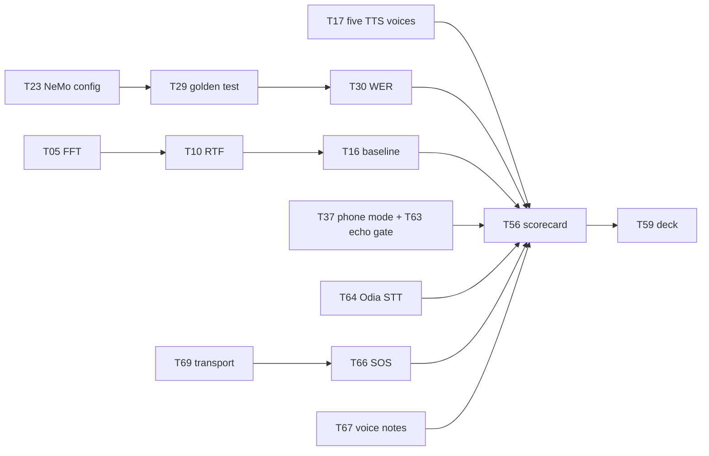

# iTantra — Task Checklist

> Smart India Hackathon 2026 · PS-26173 · As of 2026-09-21 · **Revised 2026-09-23** (second audit: T62–T69 added, T19/T43/T55 corrected — see [`IMPROVEMENT_PLAN.md` §10](IMPROVEMENT_PLAN.md#10-addendum--second-audit-2026-09-23))
> Execution list for [`ACTION_PLAN.md`](ACTION_PLAN.md); technical detail in [`IMPROVEMENT_PLAN.md`](IMPROVEMENT_PLAN.md)
>
> **G** = Gaurav (engine) · **S** = Sarthak (shell) · **B** = both
> Criterion tags: **EFF** 20% · **ACC** 40% · **LAT** 20% · **REQ** hard PS requirement · **DOC** submission material

---

## Progress

| Week | Theme | Tasks | Done | 🟡 Partial |
| --- | --- | --- | --- | --- |
| 0 | Stop work / clear the decks | 4 | 1 / 4 | — |
| 1 | Make it fast, make it measurable | 12 | 9 / 12 | T11 |
| 2 | Close the language gap | 7 | 0 / 7 | — |
| 3 | Accuracy — the 40% week | 15 | 3 / 15 | T26, T28 |
| 4 | PS compliance + remaining latency | 22 | 12 / 22 | T39 |
| 5 | Quality and headroom | 9 | 0 / 9 | — |
| 6 | The dossier | 6 | 0 / 6 | — |
| — | **Total** | **77** (T19, T55 superseded) | **25 / 77** | |

### Status key

- `[ ]` not started · `[x]` done and committed — merged to `main`, or in **open PR #17** where the task says so
- 🟡 partly done — the note on the task says which part remains
- ⚠️ corrected or superseded — read the note before starting

### Status as of 2026-09-24 (night)

On `main` (PRs #15, #17), on **`feature/stage-a`** (pushed, no PR yet, run 3 pending), or in **PR #19** (AI Assistant removal, stacked on `feature/stage-a`):

| Commit | Tasks | Where |
| --- | --- | --- |
| `2c181fe` | T05–T10, T12–T14, T25, T27 (and the done parts of T11, T26, T28) | `main` |
| `c60c609` | T41 adaptive endpointing | `main` |
| `5c3ea07` | T38 playback queue (and the focus-hardening part of T39) | `main` |
| `9c5c7e4` | T65 phrase-level pipelining | `main` |
| `ccdb9a4` | T62 Silero VAD repair — verified in `model-export/check_silero_results.txt` and on two phones | `main` |
| `e57fb7d` | Run 1 two-phone latency evidence, in `docs/latency-evidence/` | `main` |
| `a8ff983` | T70 `TTSModule` lock | `main` |
| `47644f1` | T45 model warm-up | `main` |
| `d33f8ac` | T72 walkie-talkie language picker | `main` |
| `6a45bd3` | T71 telemetry stamps | `main` |
| `bda505c` | T38/T62 comment and log cleanups | `main` |
| `71b2c17` | Run 2 evidence, in `docs/latency-evidence/run2/` | `main` |
| `489cccb` | T43 receiver speaks the text's own language | `feature/stage-a` |
| `2e897d6` | T73 VAD re-initialised after its model downloads | `feature/stage-a` |
| `2006d4c` | T46 LRU model caches (2 per module) | `feature/stage-a` |
| `7559320` | T47 RAM figure includes native memory | `feature/stage-a` |
| `0d6bde5` | T74 Assistant shares the service's models — superseded by the removal below | `feature/stage-a` |
| `a0850da` | **AI Assistant removed** (T02), plus the unused fastText pack — debug APK 99.3 MB → 60.8 MB | PR #19 |

**Measured so far** (from `docs/latency-evidence/`, run 2, warm models; every figure re-checked against the raw files):
- Phrase 1 finished transcribing **4.39 s before** PTT release and phrase 2 **0.20 s before** (run 1, cold models: +0.24 s / −0.14 s).
- Warm STT: **0.28× real time** (≈570 ms for a 2 s phrase); receiver synthesis **≈230–260 ms** per phrase.
- One TTS voice load for a whole 10-message session (T70 lock confirmed).
- The neural VAD cuts phrases mid-hold from real speech; received phrases play in order without overlap.

⚠️ Run 2's receiver was a different phone (realme RMX5000) from run 1's (OPPO CPH2721), so receiver-side before/after numbers are not a like-for-like hardware comparison. Sender-side numbers are.

### Do these next, in this order

**0. Finish Stage A and the removal.** Stage A's code (T43, T73, T46, T47, T74) is on `feature/stage-a`. Remaining: the run-3 two-phone evidence, then a PR for `feature/stage-a` → `main`. After that merges, retarget **PR #19** (AI Assistant removal) to `main` and merge it. A human has to merge; agents are blocked from it.

**Stage B — PS requirements that are still pass/fail (≈ 2.5 days).** Specs: `IMPLEMENTATION_SPEC_2.md` Group G.
5. **T37 + T63** — phone mode with the echo gate (same PR).
6. **T69** — Bluetooth in both directions.
7. **T66 (minimum)** — a "next message is an ALERT" toggle beside PTT. That is all the PS needs; alert playback (alarm stream, max volume, non-interruptible) already works. ~2 h. See the T66 entry for what was dropped.
8. **T67** — voice notes.

**Stage C — the 40% Accuracy criterion and the footprint (needs a human for hosting).**
8a. **T76 (optional, priority)** — evaluate **SraVaani 1.0** (IISc, one open model for 65 Indian languages including Odia) against the current IndicConformer models on the same test clips. Offline Python work, no app code, so it can **start now in parallel** with Stage A and B. Its verdict decides T64 (Odia) and whether the STT model should change at all.
9. **T17b + T64** — the five missing TTS voices and Odia STT (10/10 languages). Needs a hosting URL from a human.
10. **T20 + T21** — download only the selected language (2.18 GB → ~250 MB). Easy now that T72 gives the app a selected language.
11. **T23 → T29 → T30** — match the NeMo preprocessor, golden test, WER table.
12. **T15** — two ONNX runtimes still ship in the APK (`libsherpa-onnx-jni.so` 23.7 MB with its own runtime, plus `libonnxruntime.so` 16.3 MB). Consolidating is the next APK-size win after the Assistant removal.
13. **T75** — remove stale claims from `app_metadata.json`, `AppMetadata.kt` and the manifest metadata (small).
14. **Decide on 32-bit phones** — see the T14 note.

Re-run the two-phone evidence test after Stage A and after Stage B, on the **same two phones** each time.

> **Code-level specs** for the most error-prone tasks — exact before/after text, verify commands and explicit guardrails — are in [`IMPLEMENTATION_SPEC.md`](IMPLEMENTATION_SPEC.md). Hand that file to any agent doing the edits.

---

## Week 0 — Stop work

Do these before anything else. They cost almost nothing and they free the calendar.

- [ ] **T01 · Freeze the range/radio workstream** — *B · DOC · 1h*
  Stop work on `worktree-afsk-radio-link` (`MeshLink.kt`, `AfskModem.kt`, `HdlcFramer.kt`) and on `RANGE_STRATEGY.md` / `RANGE_IMPLEMENTATION.md`. Worth 0% of the rubric.
  **Done when:** branch is tagged and left alone; no further commits.

- [x] **T02 · Remove the AI Assistant** — *S · EFF · 3h*
  `app/build.gradle.kts`, `LlmModule.kt`, `AIAssistantScreen.kt`, nav graph. 2.39 GB model + llama.cpp natives, entirely outside the PS.
  ✅ **Done by deletion, not a build flag** (decided 2026-09-24): `a0850da`, PR #19. Also removed the fastText language-ID pack, which was in the compulsory download but read by no code. Measured debug APK: **99,311,356 → 60,759,386 bytes (−38.8 %)**; six `librnllama*.so` variants gone. The last commit with the Assistant is tagged `assistant-last`.

- [ ] **T03 · Buy/borrow the target phone** — *B · EFF · 1h*
  Sub-₹15,000, Snapdragon 6-series or Helio G85 class, 4 GB RAM. Every number in the submission gets measured on this one device.
  **Done when:** device in hand, model name recorded for the slides.

- [ ] **T04 · Correct the false claims in the docs** — *S · DOC · 2h*
  README core-bundle size ("~169 MB" → ~2.18 GB); README "adaptive" VAD claim; `RANGE_STRATEGY.md` §10 translation claim ("speak Hindi, the receiver hears Malayalam" — no translation code exists).
  **Done when:** no documented claim lacks code behind it.

---

## Week 1 — Make it fast, make it measurable

Nothing after this week can be evaluated until this week lands.

### The FFT fix

- [x] **T05 · Replace the naive DFT with a radix-2 FFT-512** — *G · LAT/EFF · 1d*
  `core/audio/STTModule.kt` → `computePowerSpectrum()`. Currently O(N²) with `sin`/`cos` in the inner loop: 47.9M transcendental calls per utterance. Zero-pad the 400-sample window to 512.
  **Done when:** measured feature-extraction time drops ≥ 20× on a 3 s utterance.

- [x] **T06 · Precompute the mel filterbank once** — *G · LAT/EFF · 3h*
  `STTModule.applyMelFilterbank()` rebuilds 82 `pow()`/`log10()` calls + 80×201 weights every frame. Build a sparse `(startBin, endBin, weights[])` table at init.
  **Done when:** no transcendental calls remain in the per-frame path.

- [x] **T07 · Pool the frame buffer** — *G · EFF · 1h*
  `STTModule.extractLogMelSpectrogram()` — `copyOfRange` allocates a fresh `FloatArray(400)` per frame.
  **Done when:** one reused buffer; allocation count per utterance is constant.

### Instrumentation

- [x] **T08 · Stamp the send path** — *G · LAT · 4h*
  `captureEndNs`, `featureDoneNs`, `inferDoneNs`, `txNs` through `AudioCaptureModule` → `STTModule` → `ITantraForegroundService`.
  **Done when:** speech-end → STT-complete is a real logged number.

- [x] **T09 · Stamp the receive path** — *G · LAT · 4h*
  `rxNs`, `ttsDoneNs`, `firstAudioFrameNs`. Take `firstAudioFrameNs` immediately before the first `AudioTrack.write()`, not after synthesis — the rubric asks when audio *played*.
  **Done when:** text-received → first-audio is a real logged number.

- [x] **T10 · Compute and log RTF per utterance** — *G · LAT · 2h*
  `inference_wall_time / audio_duration`, reported separately for feature extraction and the ONNX session so T05's effect is visible.
  **Done when:** RTF appears per utterance in logcat and in the UI as a rolling median.

- [ ] 🟡 **T11 · Cross-device latency via clock offset** — *G · LAT · 4h*
  Derive offset ≈ RTT/2 from the existing `SocketTransport` ping/ACK loop, then report `firstAudioFrame(B) − speechEnd(A)`. This is the headline demo number.
  **Done when:** the two-device delta is measurable without external timing gear.
  🟡 *Partial:* the offset (`Telemetry.peerClockOffsetMs = latency / 2`) is recorded in the working tree; nothing yet computes `firstAudioFrame(B) − speechEnd(A)`.

- [x] **T12 · CSV export of all metrics** — *G · DOC · 3h*
  One row per utterance to `filesDir`, pullable via adb.
  **Done when:** a CSV with real rows can be opened in a spreadsheet.

### Size and audio quality

- [x] **T13 · Delete `resampleTo16k`, play at native 22050 Hz** — *G · ACC · 1h*
  `core/audio/TTSModule.kt` + `AudioPlaybackManager.kt`. Linear interpolation with no anti-alias filter is aliasing every voice for no benefit.
  **Done when:** `AudioTrack` is built at `audio.sampleRate`; the resampler is gone.

- [x] **T14 · ABI split to arm64-v8a** — *S · EFF · 2h*
  `app/build.gradle.kts` — currently a universal APK carrying `arm64-v8a`, `armeabi-v7a`, `x86_64`.
  **Done when:** judged APK is arm64-only.
  **Open decision (2026-09-24):** `armeabi-v7a` was excluded mainly because llama.cpp had no 32-bit build. With the Assistant removed, a separate 32-bit APK split for 32-bit-only budget phones is possible, if sherpa-onnx and ONNX Runtime ship 32-bit libraries. Decide after T03 names the target phone.

- [ ] **T15 · Drop the duplicate ONNX Runtime** — *S · EFF · 4h*
  Both `onnxruntime-android` and `sherpa-onnx-static-link-onnxruntime` ship; sherpa-onnx can run the STT graphs too.
  **Done when:** one native runtime in the APK, STT still passes.

- [ ] **T16 · Take the week-0 baseline** — *B · DOC · 3h*
  Full scorecard on the T03 phone: RTF, the three latency deltas, APK size, PSS, idle CPU. This is the "before" column for the whole submission.
  **Done when:** baseline CSV committed.

**Week 1 exit:** RTF < 0.5 · APK < 80 MB · a CSV with real rows.

---

## Week 2 — Close the language gap

The PS mandates 10 languages. You ship 9 STT and 5 TTS.

- [ ] **T17a · Swap the three Piper voices to int8** — *G · EFF · 2h*
  `core/download/ModelRegistry.kt`. The release publishes `-int8.tar.bz2` variants the registry isn't using: Hindi 67.2→21.0 MB, Malayalam 67.2→20.8 MB, English 67.1→21.1 MB. **Verified saving: 138.6 MB for three string changes.** Must update `sizeBytes` and `sha256` too — the old hash belongs to the old file. Gujarati and Bengali have no int8 variant.
  **Done when:** all three re-download, verify and synthesize. Spec: `IMPLEMENTATION_SPEC.md` T17a.

- [ ] **T17b · Convert the five missing TTS voices from MMS** — *G · ACC/REQ · 2d*
  ⚠️ **These do not exist as prebuilt downloads.** The sherpa-onnx release was queried directly: of 645 assets the only MMS voice is `vits-mms-eng`. You must convert `facebook/mms-tts-{mar,kan,tam,tel,ory}` yourself using sherpa-onnx's documented script, package as `.tar.bz2`, host them, and point `ModelRegistry` at your host.
  **Done when:** all five download, extract and synthesize. Spec: `IMPLEMENTATION_SPEC.md` T17b.

- [ ] **T18 · Register the five codes in `TTSModule`** — *G · ACC/REQ · 1h*
  `LANGUAGE_TO_PACK` map: `mr`, `kn`, `ta`, `te`, `or`. Depends on T17b.
  **Done when:** `synthesize()` returns audio for all 10 languages.

- [ ] ⚠️ ~~**T19 · Document the Odia STT gap**~~ — **superseded by T64.**
  The earlier position ("no Odia model exists upstream") was wrong: only the mirror lacks it. AI4Bharat publishes `ai4bharat/indicconformer_stt_or_hybrid_ctc_rnnt_large`. Still never substitute Assamese.

- [ ] **T20 · Rework `coreTransceiverPacks()` to one language pair** — *G · EFF · 4h*
  `domain/model/ModelManifest.kt` — currently forces all 17 packs (2.18 GB). Make the compulsory set VAD + espeak-ng + the chosen pair.
  **Done when:** first-run download for one pair is < 250 MB.

- [ ] **T21 · Per-language selection in the Downloads screen** — *S · EFF · 1d*
  `ui/screen/DownloadsScreen.kt` — pick languages, show honest sizes, download on demand.
  **Done when:** a user can run the app having downloaded only their pair.

- [ ] **T22 · Licence table in the README** — *S · REQ/DOC · 3h*
  Every model: source URL, licence. **MMS-TTS is CC-BY-NC 4.0 (non-commercial)** — declare it explicitly rather than let a judge find it.
  **Done when:** table covers every downloaded artefact.

- [ ] **T64 · Odia STT + CTC-only INT8 export of all ten languages (absorbs T55)** — *G · REQ/ACC/EFF · 3d* 🔬
  Export the AI4Bharat hybrid checkpoints CTC-only, INT8, with their own `tokens.txt`; Odia first, then the other nine if the size win is real (~120 M params → expect ~125 MB, vs the mirror's ~197 MB). Host with the T17b voices. Add `STT_ODIA`. Needs a human for the hosting URL.
  **Done when:** Odia transcribes on device and has a row in the T30 WER table. Spec: `IMPLEMENTATION_SPEC_2.md` T64.

**Week 2 exit:** 10/10 TTS · 10/10 STT · bundle < 250 MB per pair.

---

## Week 3 — Accuracy (the 40% week)

Treat this as the most important week in the plan.

### Match the NeMo preprocessor

- [ ] **T23 · Extract `cfg.preprocessor` from the checkpoint** — *G · ACC · 4h*
  Do not patch from a list — read the real config out of the AI4Bharat NeMo checkpoint first.
  **Done when:** every parameter is written down and compared against the Kotlin code.

- [ ] **T24 · Add preemphasis** — *G · ACC · 1h*
  `x[i] − 0.97·x[i−1]`, absent today. Likely the largest remaining WER term.

- [x] **T25 · Slaney mel normalization** — *G · ACC · 2h*
  Area-normalize the filters; currently raw triangles, so wide high-frequency bands run hot.

- [ ] 🟡 **T26 · n_fft = 512 with `center=True`** — *G · ACC · 2h*
  Currently 400-point and uncentred — wrong bin resolution and a half-window frame offset. Folds into T05.
  🟡 *Partial:* n_fft 512 is done in the working tree; `center=True` is not.

- [x] **T27 · Periodic Hann window** — *G · ACC · 30m*
  Currently symmetric (`/(N−1)`); torch uses periodic (`/N`).

- [ ] 🟡 **T28 · Log guard and unbiased std** — *G · ACC · 30m*
  `1e-10` → `2**-24`; std to unbiased (N−1).
  🟡 *Partial:* the log guard is done in the working tree; std is still biased (N).

- [ ] **T29 · Golden-reference test** — *G · ACC · 1d*
  Run NeMo's preprocessor in Python over a fixed WAV, save the feature matrix, assert the Kotlin output matches to ~1e-3 in a JVM unit test. There are currently **zero tests on the feature path**.
  **Done when:** the test is green in CI and fails if any of T24–T28 regresses.

### Measure WER

- [ ] **T30 · WER harness** — *G · ACC/DOC · 1d*
  Per language, over a public Indic test set, CSV out. Target: **within 3 points absolute of the published IndicConformer WER** — any gap is your pipeline's fault, not the model's.
  **Done when:** a per-language WER table exists.

### Fix the front of the pipeline

- [x] **T62 · Repair the Silero VAD and make it primary** — *G · ACC/EFF · 1d* 🔬
  It was disabled after returning ~0 for silence, a sine wave and noise — the correct output for non-speech; it was never tested on speech. The downloaded file is v5+, which needs a 64-sample context prefix that `process()` omits. Prove it in Python on recorded speech first, then add the context, hysteresis, and pin the model to a release tag.
  **Done when:** logcat shows `backend: NEURAL`, speech is detected in quiet and noise, noise alone is not. Spec: `IMPLEMENTATION_SPEC_2.md` T62.

- [ ] **T31 · VAD pre-roll ring buffer** — *G · ACC · 3h*
  `core/audio/VADModule.kt` / `AudioCaptureModule.kt`. Accumulation starts only after RMS crosses threshold, so unvoiced onsets (`/k/ /t/ /p/`) are clipped off every utterance. Keep 300 ms and prepend on trigger.

- [ ] **T32 · Adaptive noise floor + hysteresis** — *G · ACC · 1d*
  ⚠️ Since 2026-09-23 this is the **fallback** path behind T62, used when the neural model is missing or fails. Still worth doing.
  Replace the fixed `rms > 0.025f`. Track a rolling floor; trigger at floor+9 dB, release at floor+4 dB.
  **Done when:** VAD works in both a quiet room and a noisy one without hitting the 30 s cap.

- [ ] **T33 · Switch to `VOICE_RECOGNITION` audio source** — *G · ACC · 1h*
  `AudioCaptureModule` uses `MediaRecorder.AudioSource.MIC`.
  ⚠️ The spec's old "no AEC — this is not a speakerphone" note was amended: phone mode **is** a speakerphone, and T63 handles the echo.

- [ ] **T34 · DC removal + `NoiseSuppressor` / `AutomaticGainControl`** — *G · ACC · 3h*
  Attach the `AudioEffect`s to the capture session.

- [ ] **T35 · Text normalization before TTS** — *S · ACC · 1d*
  Numbers (`108`, `3.5 km`), Latin tokens inside Devanagari, punctuation. Currently passed raw to espeak-ng and mispronounced.

- [ ] **T36 · Re-measure WER after T24–T34** — *G · ACC/DOC · 3h*
  **Done when:** before/after WER delta is recorded per language.

**Week 3 exit:** WER measured per language and within 3 points of published · golden test green · VAD backend measured and named.

---

## Week 4 — PS compliance and remaining latency

- [ ] **T37 · Wire phone mode to the UI** — *S · REQ · 1d*
  `ConnectionMode.PHONE_MODE` exists and `setConnectionMode()` handles it, but **nothing in `ui/` ever calls it**. The PS requires: *"if turned off it should work like a phone."*
  **Done when:** toggling PTT off gives continuous VAD-gated operation.
  ⚠️ **Must ship in the same PR as T63.**

- [ ] **T63 · Echo gate** — *G · REQ · 3h*
  Without it, phone mode transcribes its own loudspeaker and sends received messages back to the sender. Discard microphone input while `AudioPlaybackManager` is playing, plus a 250 ms tail.
  **Done when:** two phones in phone mode exchange one sentence and nothing comes back. Spec: `IMPLEMENTATION_SPEC_2.md` T63.

- [ ] **T69 · Send on every live transport + receive dedup** — *G · REQ · 2h*
  Bluetooth is used only if *this* phone started the Bluetooth server, so a phone connected as the Bluetooth client sends over TCP to nobody (Bluetooth works in one direction unless both phones have Host Beacon on). Send on every transport with a peer; drop the duplicate on receive.
  **Done when:** B (beacon off) connected to A over Bluetooth can send to A. Spec: `IMPLEMENTATION_SPEC_2.md` T69.

- [x] **T38 · Single-consumer playback queue** — *G · REQ · 4h*
  `AudioPlaybackManager.play()` builds a new `AudioTrack` per call with no mutex; concurrent messages overlap and garble.
  **Done when:** messages play strictly in sequence.

- [ ] 🟡 **T39 · ALERT pre-emption** — *G · REQ · 3h* — **optional since 2026-09-24**
  An ALERT jumps the queue head and cannot be ducked. Add `setWillPauseWhenDucked(false)` and `setAcceptsDelayedFocusGain`.
  **Done when:** an alert interrupts a playing voice note at max volume.
  🟡 *Partial:* `setWillPauseWhenDucked(false)` is in (`5c3ea07`). Pre-emption is not: an ALERT still waits behind queued messages.
  *Optional:* the PS says alerts must be "non-interruptible", i.e. an alert must not be cut off once playing — the T38 queue already guarantees that. Jumping ahead of queued messages is a nice extra, not a requirement.

- [ ] ⚠️ **T66 · Send alert-type messages (minimum version)** — *S+G · REQ · 2h* 🎨
  Nothing in `ui/` can send an ALERT, so "alert type messages will be announced at highest volume non-interruptible" cannot be demonstrated. The receive side (alarm stream, forced max volume, DND bypass attempt, non-interruptible playback) already works.
  **Trimmed 2026-09-24:** the PS asks only that alert-*type* messages exist and play loudly without interruption. It does not ask for an SOS screen, preset phrases or a full-screen dialog. Do only the "next message is an ALERT" toggle — no dependency on T69 any more. Presets, the receiver dialog and recorded phrase clips are optional polish.
  ⚠️ After T43, an alert in a language with no voice yet (Marathi, Kannada, Tamil, Telugu, Odia) arrives as text only. T17b closes that; until then, say so in the demo.
  **Done when:** with the toggle on, a spoken PTT message plays on the other phone at alarm volume; the next message is normal. Spec: `IMPLEMENTATION_SPEC_2.md` T66 → "Minimum version".

- [ ] **T67 · Voice notes** — *G+S · REQ · 0.5d* 🎨
  The PS says TTS output is "played as a voice note". Store each received utterance as a WAV and add replay on the bubble. Depends on T13.
  **Done when:** received messages can be replayed. Spec: `IMPLEMENTATION_SPEC_2.md` T67.

- [ ] **T40 · Streaming TTS on sentence boundaries** — *G · LAT · 1d*
  Split text on sentence/clause boundaries; play chunk 1 while chunk 2 synthesizes.

- [x] **T41 · Adaptive endpointing** — *G · LAT · 4h*
  Replace the fixed `SILENCE_DURATION_MS = 800` floor with 400–600 ms on a confident endpoint.

- [ ] **T42 · Sentence formation after pauses** — *G · REQ · 4h*
  The PS asks the STT module to *"form the sentences detected"*. Add punctuation/segmentation rather than emitting one flat string.

- [x] **T65 · Phrase-level pipelining while PTT is held** — *G · LAT/REQ · 1d*
  Mid-hold phrases are already cut at 800 ms, but STT runs *inside* the capture loop (the microphone stops being read during inference) and can run concurrently with the release flush (corrupting the shared FFT buffers). Add an inference lock, a single segment queue, and a 400 ms cut while PTT is held. Depends on T41 and, on the receiver, T38.
  **Done when:** phone B starts speaking phrase 1 while phone A is still holding PTT. Spec: `IMPLEMENTATION_SPEC_2.md` T65.

- [x] ⚠️ **T43 · Voice the text in its own language (`srcLang`)** — *G · ACC/REQ · 1h* — **Stage A, do first**
  `ITantraForegroundService.onTextReceived()` uses the receiver's local `ttsLanguage`, so Hindi text can be fed to a Malayalam voice.
  **Corrected 2026-09-23:** use `message.srcLang`, not `dstLang`. There is no translation, so the text is always in the spoken language; `dstLang` is only the sender's own TTS setting.
  **Measured 2026-09-24 (run 2):** every Kannada and Tamil message was synthesized `[hi]` on the receiver. Re-anchored spec: `IMPLEMENTATION_SPEC_2.md` Group H → T43.

- [ ] **T44 · Softmax the confidence score** — *G · ACC · 1h*
  `STTModule.estimateConfidence()` averages raw **logits** and clamps to [0,1] — meaningless, and it goes on the wire.

- [x] ⚠️ **T45 · Warm the models at service start and on language change** — *G · LAT · 3h*
  Both STT (~197 MB) and TTS (~70 MB) lazy-load on first use; the first message of every session pays it.
  **Measured 2026-09-24:** `STT('hi') loaded in 2306ms` on the first phrase — this alone erased the mid-hold head start in `docs/latency-evidence/`. Spec revised to also warm when the language changes (via T72).
  **Done when:** the first phrase after app start or a language change shows no `loaded in` line during PTT. Spec: `IMPLEMENTATION_SPEC_2.md` T45.
  ✅ `47644f1`, PR #17. Run 2: phrase 1 ready 4.39 s before release.

- [x] **T70 · Lock `TTSModule` like `STTModule`** — *G · EFF/LAT · 1h*
  Each received message synthesizes on its own coroutine, and `TTSModule`'s cache is an unsynchronised map, so two quick messages can load the same voice twice (extra RAM, one instance never released) and call sherpa-onnx concurrently. Suspected from the evidence logs, not confirmed.
  **Done when:** two messages 300 ms apart log exactly one `sherpa-onnx TTS loaded`. Spec: `IMPLEMENTATION_SPEC_2.md` T70.
  ✅ `a8ff983`, PR #17. Run 2: one voice load across 10 messages.

- [x] **T71 · Make the telemetry stamps mean what the rubric asks** — *G · LAT/DOC · 2h*
  Today "capture ended" is stamped after the phrase leaves the queue and before the model load, so `stt_ms` omits queue wait but includes model load. Stamp the VAD cut time, record model-load/queue time as its own column, compute RTF from processing only, and add a synthesis-only TTS column.
  **Done when:** the CSV has `wait_ms` and `tts_synth_ms` columns and `stt_ms` starts at the VAD cut. Spec: `IMPLEMENTATION_SPEC_2.md` T71.
  ✅ `6a45bd3`, PR #17. `wait_ms` caught a real 701 ms wait on the first phrase after switching to Tamil.

- [x] **T72 · Let the user choose the walkie-talkie's language** — *S+G · REQ · 0.5d* 🎨
  `sttLanguage`/`ttsLanguage` in the service default to `"hi"` and nothing ever calls `setSTTLanguage()`/`setTTSLanguage()`. The only language picker is on the AI Assistant screen and it does not reach the transceiver. So every PTT message is recognised as Hindi and spoken with the Hindi voice.
  **Done when:** picking Tamil on the Transceiver screen makes the next PTT message decode with `STT('ta')`. Spec: `IMPLEMENTATION_SPEC_2.md` T72.
  ✅ `d33f8ac`, PR #17. Tamil and Kannada STT verified on device. Side effects now tracked as T46 (models never unloaded) and T43 (receiver voice).

- [x] **T73 · Re-initialise the VAD after its model downloads** — *G · ACC/EFF · 2h* — **Stage A**
  `VADModule.initialize()` runs once at service start. On a first install that is before the VAD model has downloaded, so the app uses the energy detector until it is force-stopped (`run2/receiver_logcat_prelim_connectivity_check.txt`: `physical path: null`). React to the VAD pack's download completing.
  **Done when:** after clearing app data and downloading, logcat shows `backend: NEURAL` without a restart. Spec: `IMPLEMENTATION_SPEC_2.md` Group H → T73.

- [x] ⚠️ **T74 · The AI Assistant shares the service's models and playback queue** — *G · EFF/REQ · 2h* — **superseded**
  Implemented on `feature/stage-a` (`0d6bde5`), then made moot by removing the Assistant (PR #19), which deletes the code it changed.
  `MainViewModel` has its own `STTModule`, `TTSModule` and `AudioPlaybackManager`. Since T72 both features use the same language, so the Assistant loads a second copy of the same ~197 MB model, and its replies can play over walkie-talkie messages.
  **Done when:** one `STT('hi') loaded` per session across walkie-talkie and Assistant use. Spec: `IMPLEMENTATION_SPEC_2.md` Group H → T74.

- [x] ⚠️ **T46 · LRU model cache** — *G · EFF · 4h* — **Stage A (priority raised 2026-09-24)**
  `STTModule.sessionCache` and `TTSModule.ttsCache` are never evicted. Cap at 2 with `close()`/`release()` on eviction.
  Since T72, every language tapped loads another ~197 MB model that stays resident. The T65/T70 locks make eviction safe. Explicit spec (both modules written out): `IMPLEMENTATION_SPEC_2.md` Group H → T46.

- [x] **T47 · RAM metric → total PSS** — *G · EFF/DOC · 2h*
  `startRamMonitoring()` reads `Runtime.totalMemory() − freeMemory()` = **Java heap only**, so every native ONNX allocation is invisible. Switch to `Debug.getMemoryInfo().totalPss`.
  **Stage A:** do it with T46, so the memory saving is visible in the app's own number.
  **Done when:** the reported figure matches `dumpsys meminfo`.

**Week 4 exit:** every compliance row green — phone mode without echo, alerts sent and shown, voice notes, Bluetooth in both directions · sentence→audio < 2 s.

---

## Week 5 — Quality and headroom

- [ ] **T48 · CTC prefix beam search** — *G · ACC · 2d*
  `core/audio/CtcDecoder.kt` is greedy-only. Beam 8–16, ~150 lines, no new model.

- [ ] **T49 · Per-language KenLM** *(optional)* — *G · ACC · 1d*
  Beam + LM typically buys 10–20% relative WER on Indic ASR.

- [ ] **T50 · Streaming/chunked STT inference** — *G · LAT · 3d*
  Overlapping-window inference so the model works while the speaker is still talking. Depends on T05 and T29.
  ⚠️ Do T65 first. Start T50 only if T65's measured delay still misses target.

- [ ] **T51 · Idle power: reuse the capture buffer** — *G · EFF · 1h*
  A fresh `FloatArray(1600)` per 100 ms chunk is ~64 KB/s of garbage.

- [ ] **T52 · Idle power: running total for `speechBuffer`** — *G · EFF · 30m*
  `sumOf { it.size }` recomputed every chunk.

- [ ] **T53 · Idle power: longer wakeups** — *G · EFF · 3h*
  Process 200–300 ms per wakeup. At idle, wakeup count dominates power, not arithmetic.

- [ ] **T54 · TTS listening test** — *S · ACC/DOC · 2d*
  5 native speakers per language, 1–5 scale. Target mean ≥ 3.5.

- [ ] ⚠️ ~~**T55 · Re-export STT as CTC-only INT8**~~ — **merged into T64** (week 2). The model card confirms ~120 M parameters, so ~197 MB at INT8 is indeed oversized.

- [ ] **T68 · (Stretch) ESP32 receiver** — *G · REQ · 1d*
  The PS allows "embedded device or another phone"; only the phone half is shown. SPP UUID fallback in the app, a partial-read fix, and a ~150-line Arduino sketch. Needs an original ESP32 (not S2/S3/C3/C6). Depends on T69.
  **Done when:** speech from the phone appears on the ESP32 serial monitor; an SOS flashes/buzzes. Spec: `IMPLEMENTATION_SPEC_2.md` T68.

**Week 5 exit:** stretch targets attempted, nothing regressed.

---

## Week 6 — The dossier

No new features. Build what you are actually judged on.

- [ ] **T56 · Full scorecard run** — *B · DOC · 2d*
  All 10 languages, 3 repeats, medians, on the T03 phone. Include a 10-minute sustained run to catch thermal throttling.

- [ ] **T57 · Before/after table** — *G · DOC · 4h*
  Week 0 vs week 6 on every metric. The 43.6× FFT result is a genuinely good slide.

- [ ] **T58 · Rehearse the two-device demo** — *B · DOC · 1d*
  Include a deliberate failure-and-recovery moment. Tamil spoken on phone A, heard on phone B, stopwatch visible.

- [ ] **T59 · Slide deck built around the scorecard** — *S · DOC · 2d*
  Numbers first, architecture second. Every figure labelled measured / calculated / cited.

- [ ] **T60 · Reconcile README and all docs with reality** — *S · DOC · 4h*
  No claim without code behind it. Include a one-slide "known limitations" page — it raises scores with technical judges.

- [ ] **T61 · Record a backup demo video** — *S · DOC · 3h*
  In case live hardware fails on the day.

---

## Critical path

If the schedule compresses, this is the irreducible set. Everything else is polish.

**Cannot be cut:** T05, T10, T13, T14, T16, T17, T18, T23–T30, T37, T38, **T43, T45, T46, T62 or T32, T63, T64, T66, T67, T69, T72, T73**, T56, T57, T59.

- [ ] **T76 · Evaluate SraVaani 1.0 against IndicConformer** — *G · ACC · 1–1.5d* 🔬 — **Stage C, optional, highest priority of the optional items**
  [SraVaani 1.0](https://huggingface.co/ARTPARK-IISc/SraVaani-1.0) (IISc SPIRE Lab + ARTPARK, MIT) is one ~430M-parameter model for 65 Indian languages, Odia included, ~900 MB FP16. It may be more accurate than our ~120M-parameter, ~197 MB-per-language IndicConformer models, but it is ~3.5× the compute, which works against Efficiency, Latency and low-end phones. Measure both on the same 100 FLEURS test clips per language (WER, CER, CPU speed, size); quantise and phone-test SraVaani only if it wins by ≥ 3 WER points.
  Runs offline in Python (Linux/Colab), needs no app changes, and depends on nothing — start any time.
  **Done when:** `docs/evaluation/sravaani/` has `results.csv`, per-clip hypotheses and a README with a verdict (adopt / Odia-only / keep IndicConformer). Spec: `IMPLEMENTATION_SPEC_2.md` Group I → T76.

- [ ] **T75 · Remove stale claims from app metadata** — *S · DOC · 1h*
  `app/src/main/assets/app_metadata.json` (and the copy at the repo root), `AppMetadata.kt` and the `com.itantra.*` meta-data in `AndroidManifest.xml` still claim things the app does not do — e.g. "8–16 kbps Opus narrowband encoded streaming", "AI4Bharat IndicTTS VITS, ~14 MB per language", "Silero VAD v4". Replace each with the real component, or delete it.
  **Done when:** every value in those three files matches the README.

### Not tasks — decided, do not build

- **Translation.** The problem statement does not ask for it (`IMPROVEMENT_PLAN.md` §10.12).
- **Android/Google offline voice packs** for STT or TTS. They are closed-source; the PS bans proprietary voice SDKs, and they are missing or incomplete for Indic languages on many budget phones (`IMPROVEMENT_PLAN.md` §10.16).
- **Sending compressed audio instead of text** as the main path. Even Codec2 needs 700–3,200 bit/s against ~60 bytes of text per sentence, and the PS scores the STT and TTS modules themselves.
- **An SOS screen, preset alert phrases or a full-screen alert dialog** as requirements. Only alert-type messages are required (T66 minimum). Recorded human phrase clips for presets are optional polish, worth it only if presets are built.
- **The AI Assistant.** Removed (T02); restore from the `assistant-last` tag if ever needed outside the competition build.

---

_iTantra · Smart India Hackathon 2026 · Problem Statement #26173_
