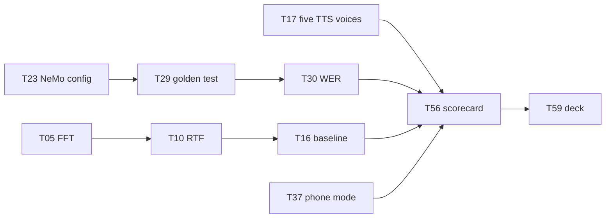

# iTantra — Task Checklist

> Smart India Hackathon 2026 · PS-26173 · As of 2026-09-21
> Execution list for [`ACTION_PLAN.md`](ACTION_PLAN.md); technical detail in [`IMPROVEMENT_PLAN.md`](IMPROVEMENT_PLAN.md)
>
> **G** = Gaurav (engine) · **S** = Sarthak (shell) · **B** = both
> Criterion tags: **EFF** 20% · **ACC** 40% · **LAT** 20% · **REQ** hard PS requirement · **DOC** submission material

---

## Progress

| Week | Theme | Tasks | Done |
| --- | --- | --- | --- |
| 0 | Stop work / clear the decks | 4 | 0 / 4 |
| 1 | Make it fast, make it measurable | 12 | 0 / 12 |
| 2 | Close the language gap | 6 | 0 / 6 |
| 3 | Accuracy — the 40% week | 14 | 0 / 14 |
| 4 | PS compliance + remaining latency | 11 | 0 / 11 |
| 5 | Quality and headroom | 8 | 0 / 8 |
| 6 | The dossier | 6 | 0 / 6 |
| — | **Total** | **61** | **0 / 61** |

---

## Week 0 — Stop work

Do these before anything else. They cost almost nothing and they free the calendar.

- [ ] **T01 · Freeze the range/radio workstream** — *B · DOC · 1h*
  Stop work on `worktree-afsk-radio-link` (`MeshLink.kt`, `AfskModem.kt`, `HdlcFramer.kt`) and on `RANGE_STRATEGY.md` / `RANGE_IMPLEMENTATION.md`. Worth 0% of the rubric.
  **Done when:** branch is tagged and left alone; no further commits.

- [ ] **T02 · Gate the AI Assistant out of the judged build** — *S · EFF · 3h*
  `app/build.gradle.kts`, `LlmModule.kt`, `AIAssistantScreen.kt`, nav graph. 2.39 GB model + llama.cpp natives, entirely outside the PS.
  **Done when:** a `judged` build variant compiles with no llamacpp dependency and no Assistant route.

- [ ] **T03 · Buy/borrow the target phone** — *B · EFF · 1h*
  Sub-₹15,000, Snapdragon 6-series or Helio G85 class, 4 GB RAM. Every number in the submission gets measured on this one device.
  **Done when:** device in hand, model name recorded for the slides.

- [ ] **T04 · Correct the false claims in the docs** — *S · DOC · 2h*
  README core-bundle size ("~169 MB" → ~2.18 GB); README "adaptive" VAD claim; `RANGE_STRATEGY.md` §10 translation claim ("speak Hindi, the receiver hears Malayalam" — no translation code exists).
  **Done when:** no documented claim lacks code behind it.

---

## Week 1 — Make it fast, make it measurable

Nothing after this week can be evaluated until this week lands.

### The FFT fix

- [ ] **T05 · Replace the naive DFT with a radix-2 FFT-512** — *G · LAT/EFF · 1d*
  `core/audio/STTModule.kt` → `computePowerSpectrum()`. Currently O(N²) with `sin`/`cos` in the inner loop: 47.9M transcendental calls per utterance. Zero-pad the 400-sample window to 512.
  **Done when:** measured feature-extraction time drops ≥ 20× on a 3 s utterance.

- [ ] **T06 · Precompute the mel filterbank once** — *G · LAT/EFF · 3h*
  `STTModule.applyMelFilterbank()` rebuilds 82 `pow()`/`log10()` calls + 80×201 weights every frame. Build a sparse `(startBin, endBin, weights[])` table at init.
  **Done when:** no transcendental calls remain in the per-frame path.

- [ ] **T07 · Pool the frame buffer** — *G · EFF · 1h*
  `STTModule.extractLogMelSpectrogram()` — `copyOfRange` allocates a fresh `FloatArray(400)` per frame.
  **Done when:** one reused buffer; allocation count per utterance is constant.

### Instrumentation

- [ ] **T08 · Stamp the send path** — *G · LAT · 4h*
  `captureEndNs`, `featureDoneNs`, `inferDoneNs`, `txNs` through `AudioCaptureModule` → `STTModule` → `ITantraForegroundService`.
  **Done when:** speech-end → STT-complete is a real logged number.

- [ ] **T09 · Stamp the receive path** — *G · LAT · 4h*
  `rxNs`, `ttsDoneNs`, `firstAudioFrameNs`. Take `firstAudioFrameNs` immediately before the first `AudioTrack.write()`, not after synthesis — the rubric asks when audio *played*.
  **Done when:** text-received → first-audio is a real logged number.

- [ ] **T10 · Compute and log RTF per utterance** — *G · LAT · 2h*
  `inference_wall_time / audio_duration`, reported separately for feature extraction and the ONNX session so T05's effect is visible.
  **Done when:** RTF appears per utterance in logcat and in the UI as a rolling median.

- [ ] **T11 · Cross-device latency via clock offset** — *G · LAT · 4h*
  Derive offset ≈ RTT/2 from the existing `SocketTransport` ping/ACK loop, then report `firstAudioFrame(B) − speechEnd(A)`. This is the headline demo number.
  **Done when:** the two-device delta is measurable without external timing gear.

- [ ] **T12 · CSV export of all metrics** — *G · DOC · 3h*
  One row per utterance to `filesDir`, pullable via adb.
  **Done when:** a CSV with real rows can be opened in a spreadsheet.

### Size and audio quality

- [ ] **T13 · Delete `resampleTo16k`, play at native 22050 Hz** — *G · ACC · 1h*
  `core/audio/TTSModule.kt` + `AudioPlaybackManager.kt`. Linear interpolation with no anti-alias filter is aliasing every voice for no benefit.
  **Done when:** `AudioTrack` is built at `audio.sampleRate`; the resampler is gone.

- [ ] **T14 · ABI split to arm64-v8a** — *S · EFF · 2h*
  `app/build.gradle.kts` — currently a universal APK carrying `arm64-v8a`, `armeabi-v7a`, `x86_64`.
  **Done when:** judged APK is arm64-only.

- [ ] **T15 · Drop the duplicate ONNX Runtime** — *S · EFF · 4h*
  Both `onnxruntime-android` and `sherpa-onnx-static-link-onnxruntime` ship; sherpa-onnx can run the STT graphs too.
  **Done when:** one native runtime in the APK, STT still passes.

- [ ] **T16 · Take the week-0 baseline** — *B · DOC · 3h*
  Full scorecard on the T03 phone: RTF, the three latency deltas, APK size, PSS, idle CPU. This is the "before" column for the whole submission.
  **Done when:** baseline CSV committed.

**Week 1 exit:** RTF < 0.5 · APK < 80 MB · a CSV with real rows.

---

## Week 2 — Close the language gap

The PS mandates 10 languages. You ship 9 STT and 5 TTS.

- [ ] **T17 · Fill the five TTS stubs in `ModelRegistry`** — *G · ACC/REQ · 1d*
  `core/download/ModelRegistry.kt` — `TTS_MARATHI`, `TTS_KANNADA`, `TTS_TAMIL`, `TTS_TELUGU`, `TTS_ODIA` currently have `fileName=""`, `downloadUrl=""`, `sizeBytes=0L`. Fill from the sherpa-onnx `tts-models` release (MMS VITS ONNX, already in the `model.onnx` + `tokens.txt` layout `TTSModule` loads).
  **Done when:** all five download, verify, and extract.

- [ ] **T18 · Register the five codes in `TTSModule`** — *G · ACC/REQ · 1h*
  `LANGUAGE_TO_PACK` map: `mr`, `kn`, `ta`, `te`, `or`.
  **Done when:** `synthesize()` returns audio for all 10 languages.

- [ ] **T19 · Source or document Odia STT** — *G · REQ · 4h*
  No Odia IndicConformer entry exists in `ModelRegistry`. Find a checkpoint, or state the gap explicitly in the submission.
  **Done when:** 10/10 STT, or a written reason for 9/10.

- [ ] **T20 · Rework `coreTransceiverPacks()` to one language pair** — *G · EFF · 4h*
  `domain/model/ModelManifest.kt` — currently forces all 17 packs (2.18 GB). Make the compulsory set VAD + espeak-ng + the chosen pair.
  **Done when:** first-run download for one pair is < 250 MB.

- [ ] **T21 · Per-language selection in the Downloads screen** — *S · EFF · 1d*
  `ui/screen/DownloadsScreen.kt` — pick languages, show honest sizes, download on demand.
  **Done when:** a user can run the app having downloaded only their pair.

- [ ] **T22 · Licence table in the README** — *S · REQ/DOC · 3h*
  Every model: source URL, licence. **MMS-TTS is CC-BY-NC 4.0 (non-commercial)** — declare it explicitly rather than let a judge find it.
  **Done when:** table covers every downloaded artefact.

**Week 2 exit:** 10/10 TTS · 10/10 STT or documented · bundle < 250 MB per pair.

---

## Week 3 — Accuracy (the 40% week)

Treat this as the most important week in the plan.

### Match the NeMo preprocessor

- [ ] **T23 · Extract `cfg.preprocessor` from the checkpoint** — *G · ACC · 4h*
  Do not patch from a list — read the real config out of the AI4Bharat NeMo checkpoint first.
  **Done when:** every parameter is written down and compared against the Kotlin code.

- [ ] **T24 · Add preemphasis** — *G · ACC · 1h*
  `x[i] − 0.97·x[i−1]`, absent today. Likely the largest remaining WER term.

- [ ] **T25 · Slaney mel normalization** — *G · ACC · 2h*
  Area-normalize the filters; currently raw triangles, so wide high-frequency bands run hot.

- [ ] **T26 · n_fft = 512 with `center=True`** — *G · ACC · 2h*
  Currently 400-point and uncentred — wrong bin resolution and a half-window frame offset. Folds into T05.

- [ ] **T27 · Periodic Hann window** — *G · ACC · 30m*
  Currently symmetric (`/(N−1)`); torch uses periodic (`/N`).

- [ ] **T28 · Log guard and unbiased std** — *G · ACC · 30m*
  `1e-10` → `2**-24`; std to unbiased (N−1).

- [ ] **T29 · Golden-reference test** — *G · ACC · 1d*
  Run NeMo's preprocessor in Python over a fixed WAV, save the feature matrix, assert the Kotlin output matches to ~1e-3 in a JVM unit test. There are currently **zero tests on the feature path**.
  **Done when:** the test is green in CI and fails if any of T24–T28 regresses.

### Measure WER

- [ ] **T30 · WER harness** — *G · ACC/DOC · 1d*
  Per language, over a public Indic test set, CSV out. Target: **within 3 points absolute of the published IndicConformer WER** — any gap is your pipeline's fault, not the model's.
  **Done when:** a per-language WER table exists.

### Fix the front of the pipeline

- [ ] **T31 · VAD pre-roll ring buffer** — *G · ACC · 3h*
  `core/audio/VADModule.kt` / `AudioCaptureModule.kt`. Accumulation starts only after RMS crosses threshold, so unvoiced onsets (`/k/ /t/ /p/`) are clipped off every utterance. Keep 300 ms and prepend on trigger.

- [ ] **T32 · Adaptive noise floor + hysteresis** — *G · ACC · 1d*
  Replace the fixed `rms > 0.025f`. Track a rolling floor; trigger at floor+9 dB, release at floor+4 dB.
  **Done when:** VAD works in both a quiet room and a noisy one without hitting the 30 s cap.

- [ ] **T33 · Switch to `VOICE_RECOGNITION` audio source** — *G · ACC · 1h*
  `AudioCaptureModule` uses `MediaRecorder.AudioSource.MIC`.

- [ ] **T34 · DC removal + `NoiseSuppressor` / `AutomaticGainControl`** — *G · ACC · 3h*
  Attach the `AudioEffect`s to the capture session.

- [ ] **T35 · Text normalization before TTS** — *S · ACC · 1d*
  Numbers (`108`, `3.5 km`), Latin tokens inside Devanagari, punctuation. Currently passed raw to espeak-ng and mispronounced.

- [ ] **T36 · Re-measure WER after T24–T34** — *G · ACC/DOC · 3h*
  **Done when:** before/after WER delta is recorded per language.

**Week 3 exit:** WER measured per language and within 3 points of published · golden test green.

---

## Week 4 — PS compliance and remaining latency

- [ ] **T37 · Wire phone mode to the UI** — *S · REQ · 1d*
  `ConnectionMode.PHONE_MODE` exists and `setConnectionMode()` handles it, but **nothing in `ui/` ever calls it**. The PS requires: *"if turned off it should work like a phone."*
  **Done when:** toggling PTT off gives continuous VAD-gated operation.

- [ ] **T38 · Single-consumer playback queue** — *G · REQ · 4h*
  `AudioPlaybackManager.play()` builds a new `AudioTrack` per call with no mutex; concurrent messages overlap and garble.
  **Done when:** messages play strictly in sequence.

- [ ] **T39 · ALERT pre-emption** — *G · REQ · 3h*
  An ALERT jumps the queue head and cannot be ducked. Add `setWillPauseWhenDucked(false)` and `setAcceptsDelayedFocusGain`.
  **Done when:** an alert interrupts a playing voice note at max volume.

- [ ] **T40 · Streaming TTS on sentence boundaries** — *G · LAT · 1d*
  Split text on sentence/clause boundaries; play chunk 1 while chunk 2 synthesizes.

- [ ] **T41 · Adaptive endpointing** — *G · LAT · 4h*
  Replace the fixed `SILENCE_DURATION_MS = 800` floor with 400–600 ms on a confident endpoint.

- [ ] **T42 · Sentence formation after pauses** — *G · REQ · 4h*
  The PS asks the STT module to *"form the sentences detected"*. Add punctuation/segmentation rather than emitting one flat string.

- [ ] **T43 · Honour `message.dstLang`** — *G · ACC/REQ · 1h*
  `ITantraForegroundService.onTextReceived()` uses the receiver's local `ttsLanguage`, so Hindi text can be fed to a Malayalam voice.

- [ ] **T44 · Softmax the confidence score** — *G · ACC · 1h*
  `STTModule.estimateConfidence()` averages raw **logits** and clamps to [0,1] — meaningless, and it goes on the wire.

- [ ] **T45 · Warm the language pair at service start** — *G · LAT · 3h*
  Both STT (~197 MB) and TTS (~70 MB) lazy-load on first use; the first message of every session pays it.

- [ ] **T46 · LRU model cache** — *G · EFF · 4h*
  `STTModule.sessionCache` and `TTSModule.ttsCache` are never evicted. Cap at 1–2 with `release()` on eviction.

- [ ] **T47 · RAM metric → total PSS** — *G · EFF/DOC · 2h*
  `startRamMonitoring()` reads `Runtime.totalMemory() − freeMemory()` = **Java heap only**, so every native ONNX allocation is invisible. Switch to `Debug.getMemoryInfo().totalPss`.
  **Done when:** the reported figure matches `dumpsys meminfo`.

**Week 4 exit:** every compliance row green · sentence→audio < 2 s.

---

## Week 5 — Quality and headroom

- [ ] **T48 · CTC prefix beam search** — *G · ACC · 2d*
  `core/audio/CtcDecoder.kt` is greedy-only. Beam 8–16, ~150 lines, no new model.

- [ ] **T49 · Per-language KenLM** *(optional)* — *G · ACC · 1d*
  Beam + LM typically buys 10–20% relative WER on Indic ASR.

- [ ] **T50 · Streaming/chunked STT inference** — *G · LAT · 3d*
  Overlapping-window inference so the model works while the speaker is still talking. Largest structural latency win; depends on T05 and T29.

- [ ] **T51 · Idle power: reuse the capture buffer** — *G · EFF · 1h*
  A fresh `FloatArray(1600)` per 100 ms chunk is ~64 KB/s of garbage.

- [ ] **T52 · Idle power: running total for `speechBuffer`** — *G · EFF · 30m*
  `sumOf { it.size }` recomputed every chunk.

- [ ] **T53 · Idle power: longer wakeups** — *G · EFF · 3h*
  Process 200–300 ms per wakeup. At idle, wakeup count dominates power, not arithmetic.

- [ ] **T54 · TTS listening test** — *S · ACC/DOC · 2d*
  5 native speakers per language, 1–5 scale. Target mean ≥ 3.5.

- [ ] **T55 · Re-export STT as CTC-only INT8** — *G · EFF · 2d*
  197.6 MB is large for an INT8 Conformer and near-identical across all nine languages — suggests hybrid quantization or an unused RNNT branch. Measure size and WER delta.

**Week 5 exit:** stretch targets attempted, nothing regressed.

---

## Week 6 — The dossier

No new features. Build what you are actually judged on.

- [ ] **T56 · Full scorecard run** — *B · DOC · 2d*
  All 10 languages, 3 repeats, medians, on the T03 phone. Include a 10-minute sustained run to catch thermal throttling.

- [ ] **T57 · Before/after table** — *G · DOC · 4h*
  Week 0 vs week 6 on every metric. The 43.6× FFT result is a genuinely good slide.

- [ ] **T58 · Rehearse the two-device demo** — *B · DOC · 1d*
  Include a deliberate failure-and-recovery moment. Tamil spoken on phone A, heard on phone B, stopwatch visible.

- [ ] **T59 · Slide deck built around the scorecard** — *S · DOC · 2d*
  Numbers first, architecture second. Every figure labelled measured / calculated / cited.

- [ ] **T60 · Reconcile README and all docs with reality** — *S · DOC · 4h*
  No claim without code behind it. Include a one-slide "known limitations" page — it raises scores with technical judges.

- [ ] **T61 · Record a backup demo video** — *S · DOC · 3h*
  In case live hardware fails on the day.

---

## Critical path

If the schedule compresses, this is the irreducible set. Everything else is polish.

**Cannot be cut:** T05, T10, T13, T14, T16, T17, T18, T23–T30, T37, T38, T56, T57, T59.

---

_iTantra · Smart India Hackathon 2026 · Problem Statement #26173_
