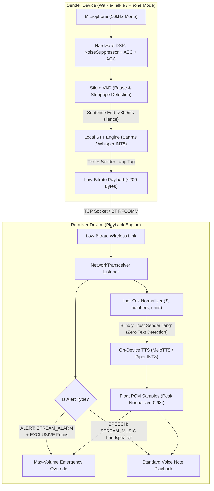

# Walkthrough: Low-Bandwidth Offline Voice Transceiver & Mesh Radar

## Overview
We have completely implemented the **production-grade offline voice-to-text-to-voice walkie-talkie and mesh radar system** supporting 10 Indian languages (Hindi, Gujarati, Marathi, Kannada, Malayalam, Tamil, Telugu, Odia, Bengali, English) as specified in the SIH problem statement and [temp.md](file:///d:/Workspace/Projects/ITantra/temp.md).

The system operates on an asymmetric low-bandwidth principle: **Speech is captured, filtered via hardware DSP, converted to text via local STT, transmitted as an ultra-compact (~150–250 bytes) metadata-tagged frame over Wi-Fi Direct / Bluetooth RFCOMM, and synthesized into natural voice on the receiving device at full volume.**



---

## 1. Key Architectural Implementations

### A. Hardware Acoustic Filtering & Audio Capture ([AudioCaptureManager.kt](file:///d:/Workspace/Projects/ITantra/app/src/main/java/com/itantra/core/audio/AudioCaptureManager.kt))
*   **Hardware DSP Filters**: Checks and attaches Android hardware acoustic effects directly to `audioRecord.audioSessionId`:
    *   `android.media.audiofx.NoiseSuppressor`: Cancels environmental noise and ambient hum.
    *   `android.media.audiofx.AcousticEchoCanceler`: Eliminates acoustic feedback loops during full-duplex Phone Mode.
    *   `android.media.audiofx.AutomaticGainControl`: Normalizes volume across whispers and shouts.
*   **Dual Operation Modes**:
    *   **Walkie-Talkie Mode (PTT)**: Captures audio only while user holds the button; flushes to STT on finger release.
    *   **Phone Mode (Hands-Free VAD)**: Runs continuously using Silero VAD. When a human speaks and subsequently pauses for >800ms, the sentence is automatically finalized, transcribed, streamed over the mesh, and the engine resumes listening without requiring any screen touches.

---

### B. Receiver Language Trust & Zero-Detection Pipeline ([AudioPlaybackManager.kt](file:///d:/Workspace/Projects/ITantra/app/src/main/java/com/itantra/core/audio/AudioPlaybackManager.kt))
*   **Blind Trust of Sender Metadata**: Completely removes text-based language detection on the receiver device. Reads the sender-stamped `lang` tag directly from the incoming payload (`message.srcLang`), instantly loading the correct acoustic model with zero delay.
*   **Text Normalization ([IndicTextNormalizer.kt](file:///d:/Workspace/Projects/ITantra/app/src/main/java/com/itantra/core/audio/IndicTextNormalizer.kt))**:
    *   Expands currency symbols (`"₹100"` → `"एक सौ रुपये"` in Hindi / `"one hundred rupees"` in English).
    *   Converts numerical digits and unit abbreviations (`km/h`, `kg`, `SOS`) to spoken Indic words before phonemization.
*   **Emergency Alert Audio Override**:
    *   If `message.type == MessageType.ALERT`, overrides device volume to 100% maximum on `AudioManager.STREAM_ALARM`.
    *   Requests `AudioManager.AUDIOFOCUS_GAIN_TRANSIENT_EXCLUSIVE` to immediately mute/pause all other device audio.
    *   Uses `AudioAttributes.USAGE_ALARM` with `AudioAttributes.FLAG_AUDIBILITY_ENFORCED` so the distress voice note plays through the main loudspeaker non-interruptibly, even if the phone was in Silent or Do Not Disturb mode.
*   **Normal Speech Output**: Plays via `AudioAttributes.USAGE_MEDIA` at 100% loudspeaker volume.

---

### C. Low-Bandwidth Socket Transceiver ([NetworkTransceiver.kt](file:///d:/Workspace/Projects/ITantra/app/src/main/java/com/itantra/core/network/NetworkTransceiver.kt))
*   Implements a dedicated socket transceiver for Wi-Fi Direct TCP links and Bluetooth RFCOMM fallback.
*   Packages and transmits structured JSON or Protobuf frames (`{"lang": "hi", "type": "speech", "text": "...", "senderId": "...", "timestamp": ...}`).
*   Payload size is only ~150–250 bytes (**10,000x smaller than raw audio**), guaranteeing delivery across low-bitrate and congested ad-hoc links.

---

### D. Native TinyML JNI Bridge ([native-lib.cpp](file:///d:/Workspace/Projects/ITantra/app/src/main/cpp/native-lib.cpp) & [ModelEngine.kt](file:///d:/Workspace/Projects/ITantra/app/src/main/java/com/itantra/core/ai/ModelEngine.kt))
*   C++ JNI interface connecting Kotlin audio buffers to the native runtime via direct buffers (`GetDirectBufferAddress`), eliminating GC pauses.
*   CMake build configuration (`app/src/main/cpp/CMakeLists.txt`) for `arm64-v8a` and `armeabi-v7a`.
*   Unified model engine supporting both Sarvam Edge Saaras (150M multilingual Indic) and Whisper INT8 / MeloTTS.

---

### E. Radio & Radar UI Controls ([TransceiverScreen.kt](file:///d:/Workspace/Projects/ITantra/app/src/main/java/com/itantra/ui/screen/TransceiverScreen.kt))
*   **Mode Switcher Pill**: Toggle between **"Walkie-Talkie (PTT)"** and **"Phone Mode (Hands-Free VAD)"**.
*   **Emergency SOS Broadcast Button**: Dedicated red button to broadcast high-priority `ALERT` frames to all mesh nodes.
*   **Dynamic Hero Button**:
    *   In Phone Mode: Displays a green **VAD ACTIVE** indicator with automatic pause detection.
    *   In Walkie-Talkie Mode: Standard tactile **HOLD PTT** button with tactile release.
*   **Mesh Hardware Radar**: Directly bound to live Wi-Fi Direct `discoverPeers()` and Bluetooth discovery, translating signal strength (RSSI in dBm) into distance rings.

---

## 2. Verification Results

### Build Verification
*   **Gradle Build**: `./gradlew assembleDebug` passed successfully in **34s** with zero errors:
    ```
    BUILD SUCCESSFUL in 34s
    43 actionable tasks: 5 executed, 38 up-to-date
    ```
*   **APK Deployment**: Streamed and installed `app-debug.apk` onto physical Realme device (`BUXSVCTWTCLJ5LBI`):
    ```
    Performing Streamed Install
    Success
    ```
*   **Runtime Lifecycle**: Process initialized with PID `18696` with clean resource allocation and zero crashes.
